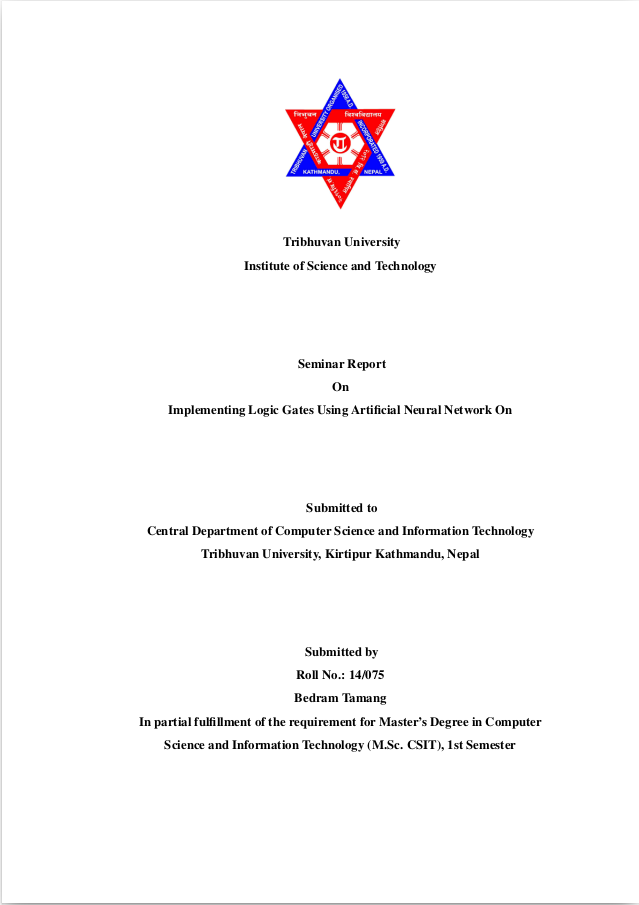

# MscCSIT Latex Seminar Report Format 

### How to use Latex
Before to start documentation, your system must have latex compiler and latex editor (Recommendated but optional). 

### Installing Latex Compiler
```shell
sudo apt install texlive-base
```

### Install Other library
```
sudo apt install texlive-science
```

### Installing latex Editor
https://www.texstudio.org/


### Preview
